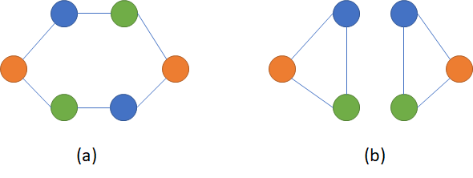

# 图结构数据

**注：本节大部分内容（包括图片）来源于["Chapter 2 - Foundations of Graphs, Deep Learning on Graphs"](https://cse.msu.edu/~mayao4/dlg_book/chapters/chapter2.pdf)，我们做了翻译与重新排版，并增加了一些细节内容。**

## 一、图的表示

**定义一（图）**：

- 一个图被记为$\mathcal{G}=\{\mathcal{V}, \mathcal{E}\}$，其中 $\mathcal{V}=\left\{v_{1}, \ldots, v_{N}\right\}$是数量为$N=|\mathcal{V}|$ 的节点的集合， $\mathcal{E}=\left\{e_{1}, \ldots, e_{M}\right\}$ 是数量为 $M$ 的边的集合。
- 图用节点表示实体（entities ），用边表示实体间的关系（relations）。
- 节点和边的信息可以是**类别型**的（categorical），类别型数据的取值只能是哪一类别。一般称类别型的信息为**标签（label）**。
- 节点和边的信息可以是**数值型**的（numeric），数值型数据的取值范围为实数。一般称数值型的信息为**属性（attribute）**。
- 在图的计算任务中，我们认为，节点一定含有信息（至少含有节点的度的信息），边可能含有信息。

**定义二（图的邻接矩阵）**：

- 给定一个图$\mathcal{G}=\{\mathcal{V}, \mathcal{E}\}$，其对应的**邻接矩阵**被记为$\mathbf{A} \in\{0,1\}^{N \times N}$。$\mathbf{A}_{i, j}=1$表示存在从节点$v_i$到$v_j$的边，反之表示不存在从节点$v_i$到$v_j$的边。

- 在**无向图**中，从节点$v_i$到$v_j$的边存在，意味着从节点$v_j$到$v_i$的边也存在。因而**无向图的邻接矩阵是对称的**。

- 在**无权图**中，**各条边的权重被认为是等价的**，即认为**各条边的权重为$1$**。

- 对于**有权图**，其对应的邻接矩阵通常被记为$\mathbf{W} \in\{0,1\}^{N \times N}$，其中$\mathbf{W}_{i, j}=w_{ij}$表示从节点$v_i$到$v_j$的边的权重。若边不存在时，边的权重为$0$。
	

	一个无向无权图的例子：

	
  
  其邻接矩阵为：
  $$
  \mathbf{A}=\left(\begin{array}{lllll}
    0 & 1 & 0 & 1 & 1 \\
    1 & 0 & 1 & 0 & 0 \\
    0 & 1 & 0 & 0 & 1 \\
    1 & 0 & 0 & 0 & 1 \\
    1 & 0 & 1 & 1 & 0
    \end{array}\right)
  $$

## 二、图的属性

**定义三（节点的度，degree）**：

- 对于有向有权图，节点$v_i$的出度（out degree）等于从$v_i$出发的边的权重之和，节点$v_i$的入度（in degree）等于从连向$v_i$的边的权重之和。
- 无向图是有向图的特殊情况，节点的出度与入度相等。
- 无权图是有权图的特殊情况，各边的权重为$1$，那么节点$v_i$的出度（out degree）等于从$v_i$出发的边的数量，节点$v_i$的入度（in degree）等于从连向$v_i$的边的数量。
- 节点$v_i$的度记为$d(v_i)$，入度记为$d_{in}(v_i)$，出度记为$d_{out}(v_i)$。

**定义四（邻接节点，neighbors）**：

- **节点$v_i$的邻接节点为与节点$v_i$直接相连的节点**，其被记为**$\mathcal{N(v_i)}$**。
- **节点$v_i$的$k$跳远的邻接节点（neighbors with $k$-hop）**指的是到节点$v_i$要走$k$步的节点（一个节点的$2$跳远的邻接节点包含了自身）。

**定义五（行走，walk）**：

- $walk(v_1, v_2) = (v_1, e_6,e_5,e_4,e_1,v_2)$，这是一次“行走”，它是一次从节点$v_1$出发，依次经过边$e_6,e_5,e_4,e_1$，最终到达节点$v_2$的“行走”。
- 下图所示为$walk(v_1, v_2) = (v_1, e_6,e_5,e_4,e_1,v_2)$，其中红色数字标识了边的访问序号。
- 在“行走”中，节点是允许重复的。

**定理六**：

- 有一图，其邻接矩阵为 $\mathbf{A}$, $\mathbf{A}^{n}$为邻接矩阵的$n$次方，那么$\mathbf{A}^{n}[i,j]$等于从节点$v_i$到节点$v_j$的长度为$n$的行走的个数。

**定义七（路径，path）**：

- “路径”是节点不可重复的“行走”。

**定义八（子图，subgraph）**：

- 有一图$\mathcal{G}=\{\mathcal{V}, \mathcal{E}\}$，另有一图$\mathcal{G}^{\prime}=\{\mathcal{V}^{\prime}, \mathcal{E}^{\prime}\}$，其中$\mathcal{V}^{\prime} \in \mathcal{V}$，$\mathcal{E}^{\prime} \in \mathcal{E}$并且$\mathcal{V}^{\prime}$不包含$\mathcal{E}^{\prime}$中未出现过的节点，那么$\mathcal{G}^{\prime}$是$\mathcal{G}$的子图。

**定义九（连通分量，connected component）**：

- 给定图$\mathcal{G}^{\prime}=\{\mathcal{V}^{\prime}, \mathcal{E}^{\prime}\}$是图$\mathcal{G}=\{\mathcal{V}, \mathcal{E}\}$的子图。记属于图$\mathcal{G}$但不属于$\mathcal{G}^{\prime}$图的节点集合记为$\mathcal{V}/\mathcal{V}^{\prime}$ 。如果属于$\mathcal{V}^{\prime}$的任意节点对之间存在至少一条路径，但不存在一条边连接属于$\mathcal{V}^{\prime}$的节点与属于$\mathcal{V}/\mathcal{V}^{\prime}$的节点，那么图$\mathcal{G}^{\prime}$是图$\mathcal{G}$的连通分量。

    

    左右两边子图都是整图的连通分量。

**定义十（连通图，connected graph）**：

- 当一个图只包含一个连通分量，即其自身，那么该图是一个连通图。

**定义十一（最短路径，shortest path）**：

- $v_{s}, v_{t} \in \mathcal{V}$ 是图$\mathcal{G}=\{\mathcal{V}, \mathcal{E}\}$上的一对节点，节点对$v_{s}, v_{t} \in \mathcal{V}$之间所有路径的集合记为$\mathcal{P}_{\mathrm{st}}$。节点对$v_{s}, v_{t}$之间的最短路径$p_{\mathrm{s} t}^{\mathrm{sp}}$为$\mathcal{P}_{\mathrm{st}}$中长度最短的一条路径，其形式化定义为
    $$
    p_{\mathrm{s} t}^{\mathrm{sp}}=\arg \min _{p \in \mathcal{P}_{\mathrm{st}}}|p|
    $$
    其中，$p$表示$\mathcal{P}_{\mathrm{st}}$中的一条路径，$|p|$是路径$p$的长度。

**定义十二（直径，diameter）**：

- 给定一个连通图$\mathcal{G}=\{\mathcal{V}, \mathcal{E}\}$，其直径为其所有节点对之间的**最短路径的最大值**，形式化定义为

$$
\operatorname{diameter}(\mathcal{G})=\max _{v_{s}, v_{t} \in \mathcal{V}} \min _{p \in \mathcal{P}_{s t}}|p|
$$

**定义十三（拉普拉斯矩阵，Laplacian Matrix）**：

- 给定一个图$\mathcal{G}=\{\mathcal{V}, \mathcal{E}\}$，其邻接矩阵为$A$，其拉普拉斯矩阵定义为$\mathbf{L=D-A}$，其中$\mathbf{D=diag(d(v_1), \cdots, d(v_N))}$。

**定义十四（对称归一化的拉普拉斯矩阵，Symmetric normalized Laplacian）**：

- 给定一个图$\mathcal{G}=\{\mathcal{V}, \mathcal{E}\}$，其邻接矩阵为$A$，其规范化的拉普拉斯矩阵定义为

$$
\mathbf{L=D^{-\frac{1}{2}}(D-A)D^{-\frac{1}{2}}=I-D^{-\frac{1}{2}}AD^{-\frac{1}{2}}}
$$

## 三、图的种类

- **同质图**（Homogeneous Graph）：只有一种类型的节点和一种类型的边的图。
- **异质图**（Heterogeneous Graph）：存在多种类型的节点和多种类型的边的图。
  
- **二部图**（Bipartite Graphs）：节点分为两类，只有不同类的节点之间存在边。
  

## 四、图结构数据上的机器学习

1. **节点预测**：预测节点的类别或某类属性的取值
   1. 例子：对是否是潜在客户分类、对游戏玩家的消费能力做预测
2. **边预测**：预测两个节点间是否存在链接
   1. 例子：Knowledge graph completion、好友推荐、商品推荐
3. **图的预测**：对不同的图进行分类或预测图的属性
   1. 例子：分子属性预测
4. **节点聚类**：检测节点是否形成一个社区
   1. 例子：社交圈检测
5. **其他任务**
   1. **图生成**：例如药物发现
   2. **图演变**：例如物理模拟
   3. ……

## 五、应用神经网络于图面临的挑战

在学习了简单的图论知识，我们再来回顾应用神经网络于图面临的挑战。

过去的深度学习应用中，我们主要接触的数据形式主要是这四种：**矩阵、张量、序列（sequence）和时间序列（time series）**，**它们都是规则的结构化的数据。然而图数据是非规则的非结构化的**，它具有以下的特点：

1. **任意的大小和复杂的拓扑结构；**
2. **没有固定的节点排序或参考点；**
3. **通常是动态的，并具有多模态的特征；**
4. **图的信息并非只蕴含在节点信息和边的信息中，图的信息还包括了图的拓扑结构。**

以往的深度学习技术是为规则且结构化的数据设计的，无法直接用于图数据。应用于图数据的神经网络，要求

- **适用于不同度的节点**；
- **节点表征的计算与邻接节点的排序无关**；
- **不但能够根据节点信息、邻接节点的信息和边的信息计算节点表征，还能根据图拓扑结构计算节点表征**。下面的图片展示了一个需要根据图拓扑结构计算节点表征的例子。图片中展示了两个图，它们同样有俩黄、俩蓝、俩绿，共6个节点，因此它们的节点信息相同；假设边两端节点的信息为边的信息，那么这两个图有一样的边，即它们的边信息相同。但这两个图是不一样的图，它们的拓扑结构不一样。

## 六、结语

在此篇文章中，我们学习了简单的图论知识。对于学习此次组队学习后续的内容，掌握这些图论知识已经足够。如果有小伙伴希望掌握更多的图论知识可以参阅参考文献“[Chapter 2 - Foundations of Graphs, Deep Learning on Graphs](https://cse.msu.edu/~mayao4/dlg_book/chapters/chapter2.pdf)”。

## 参考资料

- [Chapter 2 - Foundations of Graphs, Deep Learning on Graphs](https://cse.msu.edu/~mayao4/dlg_book/chapters/chapter2.pdf)

