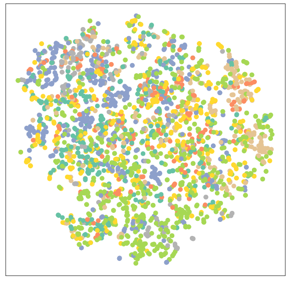
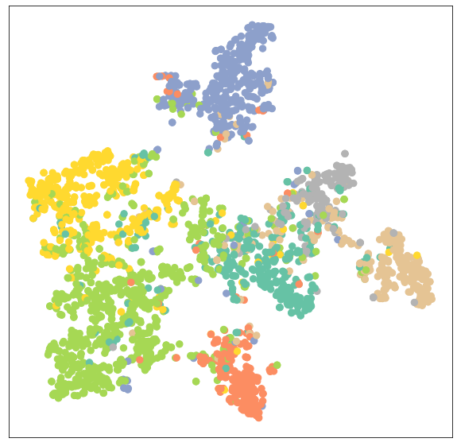

# 基于图神经网络的节点表征学习

## 引言

在图节点预测或边预测任务中，首先需要生成节点表征（Node Representation）。**我们使用图神经网络来生成节点表征，并通过基于监督学习的对图神经网络的训练，使得图神经网络学会产生高质量的节点表征**。**高质量的节点表征能够用于衡量节点的相似性，同时高质量的节点表征也是准确分类节点的前提。**

本节中，我们将**学习实现多层图神经网络的方法**，并以节点分类任务为例，**学习训练图神经网络的一般过程**。我们将以`Cora `数据集为例子进行说明，`Cora `是一个论文引用网络，节点代表论文，如果两篇论文存在引用关系，则对应的两个节点之间存在边，各节点的属性都是一个1433维的词包特征向量。我们的任务是预测各篇论文的类别（共7类）。我们还将对MLP和GCN, GAT（两个知名度很高的图神经网络）三类神经网络在节点分类任务中的表现进行比较分析，以此来展现图神经网络的强大和论证图神经网络强于普通深度神经网络的原因。

此节内容安排如下：

1. 首先，我们要做一些准备工作，即**获取并分析数据集**、**构建一个方法用于分析节点表征的分布**。
2. 然后，我们**考察MLP神经网络用于节点分类的表现**，并**观察基于MLP神经网络学习到的节点表征的分布**。
3. 接着，我们**逐一介绍GCN, GAT这两个图神经网络的理论、对比它们在节点分类任务中的表现以及它们学习到的节点表征的质量**。
4. 最后，我们**比较三者在节点表征学习能力上的差异**。

## 准备工作

### 获取并分析数据集

```python
from torch_geometric.datasets import Planetoid
from torch_geometric.transforms import NormalizeFeatures

dataset = Planetoid(root='dataset', name='Cora', transform=NormalizeFeatures())

print()
print(f'Dataset: {dataset}:')
print('======================')
print(f'Number of graphs: {len(dataset)}')
print(f'Number of features: {dataset.num_features}')
print(f'Number of classes: {dataset.num_classes}')

data = dataset[0]  # Get the first graph object.

print()
print(data)
print('======================')

# Gather some statistics about the graph.
print(f'Number of nodes: {data.num_nodes}')
print(f'Number of edges: {data.num_edges}')
print(f'Average node degree: {data.num_edges / data.num_nodes:.2f}')
print(f'Number of training nodes: {data.train_mask.sum()}')
print(f'Training node label rate: {int(data.train_mask.sum()) / data.num_nodes:.2f}')
print(f'Contains isolated nodes: {data.contains_isolated_nodes()}')
print(f'Contains self-loops: {data.contains_self_loops()}')
print(f'Is undirected: {data.is_undirected()}')

```

我们可以看到，`Cora`图拥有2,708个节点和10,556条边，平均节点度为3.9，训练集仅使用了140个节点，占整体的5%。我们还可以看到，这个图是无向图，不存在孤立的节点。

**数据转换（transform）在将数据输入到神经网络之前修改数据，这一功能可用于实现数据规范化或数据增强**。在此例子中，我们使用[`NormalizeFeatures`](https://pytorch-geometric.readthedocs.io/en/latest/modules/transforms.html#torch_geometric.transforms.NormalizeFeature)进行节点特征归一化，使各节点特征总和为`1`。其他的数据转换方法请参阅[torch-geometric-transforms](https://pytorch-geometric.readthedocs.io/en/latest/modules/transforms.html#torch-geometric-transforms)。

### 可视化节点表征分布的方法

```python
import matplotlib.pyplot as plt
from sklearn.manifold import TSNE

def visualize(h, color):
    z = TSNE(n_components=2).fit_transform(out.detach().cpu().numpy())
    plt.figure(figsize=(10,10))
    plt.xticks([])
    plt.yticks([])

    plt.scatter(z[:, 0], z[:, 1], s=70, c=color, cmap="Set2")
    plt.show()

```

我们先利用[**TSNE**](https://scikit-learn.org/stable/modules/generated/sklearn.manifold.TSNE.html)方法将高维的节点表征映射到二维平面空间，然后在二维平面画出节点，这样我们就实现了节点表征分布的可视化。

## 使用MLP神经网络进行节点分类

理论上，我们应该能够仅根据文章的内容，即它的词包特征表征（bag-of-words feature representation）来推断文章的类别，而无需考虑文章之间的任何关系信息。接下来，让我们通过构建一个简单的MLP神经网络来验证这一点。此神经网络只对输入节点的表征做变换，它在所有节点之间共享权重。

### MLP神经网络的构造

```python
import torch
from torch.nn import Linear
import torch.nn.functional as F

class MLP(torch.nn.Module):
    def __init__(self, hidden_channels):
        super(MLP, self).__init__()
        torch.manual_seed(12345)
        self.lin1 = Linear(dataset.num_features, hidden_channels)
        self.lin2 = Linear(hidden_channels, dataset.num_classes)

    def forward(self, x):
        x = self.lin1(x)
        x = x.relu()
        x = F.dropout(x, p=0.5, training=self.training)
        x = self.lin2(x)
        return x

model = MLP(hidden_channels=16)
print(model)

```

我们的MLP由两个线程层、一个`ReLU`非线性层和一个`dropout`操作组成。第一个线程层将1433维的节点表征嵌入（embedding）到低维空间中（`hidden_channels=16`），第二个线性层将节点表征嵌入到类别空间中（`num_classes=7`）。

### MLP神经网络的训练

我们利用**交叉熵损失**和**Adam优化器**来训练这个简单的MLP神经网络。

```python
model = MLP(hidden_channels=16)
criterion = torch.nn.CrossEntropyLoss()  # Define loss criterion.
optimizer = torch.optim.Adam(model.parameters(), lr=0.01, weight_decay=5e-4)  # Define optimizer.

def train():
    model.train()
    optimizer.zero_grad()  # Clear gradients.
    out = model(data.x)  # Perform a single forward pass.
    loss = criterion(out[data.train_mask], data.y[data.train_mask])  # Compute the loss solely based on the training nodes.
    loss.backward()  # Derive gradients.
    optimizer.step()  # Update parameters based on gradients.
    return loss

for epoch in range(1, 201):
    loss = train()
    print(f'Epoch: {epoch:03d}, Loss: {loss:.4f}')

```

### MLP神经网络的测试

训练完模型后，我们可以通过测试来检验这个简单的MLP神经网络在测试集上的表现。

```python
def test():
    model.eval()
    out = model(data.x)
    pred = out.argmax(dim=1)  # Use the class with highest probability.
    test_correct = pred[data.test_mask] == data.y[data.test_mask]  # Check against ground-truth labels.
    test_acc = int(test_correct.sum()) / int(data.test_mask.sum())  # Derive ratio of correct predictions.
    return test_acc

test_acc = test()
print(f'Test Accuracy: {test_acc:.4f}')
```

正如我们所看到的，我们的MLP表现相当糟糕，只有大约59%的测试准确性。

**为什么MLP没有表现得更好呢？**其中一个重要原因是，用于训练此神经网络的有标签节点数量过少，此神经网络被过拟合，它对未见过的节点泛化能力很差。

## 卷积图神经网络（GCN）

### GCN的定义

GCN 来源于论文“[Semi-supervised Classification with Graph Convolutional Network](https://arxiv.org/abs/1609.02907)”，其数学定义为，
$$
\mathbf{X}^{\prime} = \mathbf{\hat{D}}^{-1/2} \mathbf{\hat{A}}
\mathbf{\hat{D}}^{-1/2} \mathbf{X} \mathbf{\Theta},
$$
其中$\mathbf{\hat{A}} = \mathbf{A} + \mathbf{I}$表示插入自环的邻接矩阵（使得每一个节点都有一条边连接到自身），$\hat{D}_{ii} = \sum_{j=0} \hat{A}_{ij}$表示$\mathbf{\hat{A}}$的对角线度矩阵（对角线元素为对应节点的度，其余元素为0）。邻接矩阵可以包括不为$1$的值，当邻接矩阵不为`{0,1}`值时，表示邻接矩阵存储的是边的权重。$\mathbf{\hat{D}}^{-1/2} \mathbf{\hat{A}}
\mathbf{\hat{D}}^{-1/2}$是对称归一化矩阵，它的节点式表述为：
$$
\mathbf{x}^{\prime}_i = \mathbf{\Theta} \sum_{j \in \mathcal{N}(v) \cup
\{ i \}} \frac{e_{j,i}}{\sqrt{\hat{d}_j \hat{d}_i}} \mathbf{x}_j
$$
其中，$\hat{d}_i = 1 + \sum_{j \in \mathcal{N}(i)} e_{j,i}$，$e_{j,i}$表示从源节点$j$到目标节点$i$的边的对称归一化系数（默认值为1.0）。

### PyG中`GCNConv` 模块说明

`GCNConv`构造函数接口：

```python
GCNConv(in_channels: int, out_channels: int, improved: bool = False, cached: bool = False, add_self_loops: bool = True, normalize: bool = True, bias: bool = True, **kwargs)
```

其中：

- `in_channels `：输入数据维度；
- `out_channels `：输出数据维度；
- `improved `：如果为`true`，$\mathbf{\hat{A}} = \mathbf{A} + 2\mathbf{I}$，其目的在于增强中心节点自身信息；
- `cached `：是否存储$\mathbf{\hat{D}}^{-1/2} \mathbf{\hat{A}} \mathbf{\hat{D}}^{-1/2}$的计算结果以便后续使用，这个参数只应在归纳学习（transductive learning）的场景中设置为`true`（归纳学习可以简单理解为在训练、验证、测试、推理（inference）四个阶段都只使用一个数据集）；
- `add_self_loops `：是否在邻接矩阵中增加自环边；
- `normalize `：是否添加自环边并在运行中计算对称归一化系数；
- `bias `：是否包含偏置项。

详细内容请大家参阅[GCNConv官方文档](https://pytorch-geometric.readthedocs.io/en/latest/modules/nn.html#torch_geometric.nn.conv.GCNConv)。

### GCN图神经网络的构造

将上面例子中的`torch.nn.Linear`替换成`torch_geometric.nn.GCNConv`，我们就可以得到一个GCN图神经网络，如下方代码所示：

```python
from torch_geometric.nn import GCNConv

class GCN(torch.nn.Module):
    def __init__(self, hidden_channels):
        super(GCN, self).__init__()
        torch.manual_seed(12345)
        self.conv1 = GCNConv(dataset.num_features, hidden_channels)
        self.conv2 = GCNConv(hidden_channels, dataset.num_classes)

    def forward(self, x, edge_index):
        x = self.conv1(x, edge_index)
        x = x.relu()
        x = F.dropout(x, p=0.5, training=self.training)
        x = self.conv2(x, edge_index)
        return x

model = GCN(hidden_channels=16)
print(model)

```

### 可视化由未经训练的GCN图神经网络生成的节点表征

代码如下所示：

```python
model = GCN(hidden_channels=16)
model.eval()

out = model(data.x, data.edge_index)
visualize(out, color=data.y)
```

经过`visualize`函数的处理，7维特征的节点被映射到2维的平面上。我们会惊喜地看到“同类节点群聚”的现象。



### GCN图神经网络的训练

通过下方的代码我们可实现GCN图神经网络的训练：

```python
model = GCN(hidden_channels=16)
optimizer = torch.optim.Adam(model.parameters(), lr=0.01, weight_decay=5e-4)
criterion = torch.nn.CrossEntropyLoss()

def train():
      model.train()
      optimizer.zero_grad()  # Clear gradients.
      out = model(data.x, data.edge_index)  # Perform a single forward pass.
      loss = criterion(out[data.train_mask], data.y[data.train_mask])  # Compute the loss solely based on the training nodes.
      loss.backward()  # Derive gradients.
      optimizer.step()  # Update parameters based on gradients.
      return loss

for epoch in range(1, 201):
    loss = train()
    print(f'Epoch: {epoch:03d}, Loss: {loss:.4f}')

```

### GCN图神经网络的测试

在训练过程结束后，我们检测GCN图神经网络在测试集上的准确性：

```python
def test():
      model.eval()
      out = model(data.x, data.edge_index)
      pred = out.argmax(dim=1)  # Use the class with highest probability.
      test_correct = pred[data.test_mask] == data.y[data.test_mask]  # Check against ground-truth labels.
      test_acc = int(test_correct.sum()) / int(data.test_mask.sum())  # Derive ratio of correct predictions.
      return test_acc

test_acc = test()
print(f'Test Accuracy: {test_acc:.4f}')
```

通过简单地将`torch.nn.Linear`替换成`torch_geometric.nn.GCNConv`，我们可以取得81.4%的测试准确率！与前面的仅获得59%的测试准确率的MLP图神经网络相比，GCN图神经网络准确性要高得多。这表明**节点的邻接信息在取得更好的准确率方面起着关键作用**。

### 可视化由训练后的GCN图神经网络生成的节点表征

最后我们可视化训练后的GCN图神经网络生成的节点表征，我们会发现“同类节点群聚”的现象更加明显了。这意味着在训练后，GCN图神经网络生成的节点表征质量更高了。
```python
model.eval()

out = model(data.x, data.edge_index)
visualize(out, color=data.y)
```



## 图注意力神经网络（GAT）

### GAT的定义

图注意神经网络（GAT）来源于论文 [Graph Attention Networks](https://arxiv.org/abs/1710.10903)。其数学定义为，
$$
\mathbf{x}^{\prime}_i = \alpha_{i,i}\mathbf{\Theta}\mathbf{x}_{i} +
\sum_{j \in \mathcal{N}(i)} \alpha_{i,j}\mathbf{\Theta}\mathbf{x}_{j},
$$
其中注意力系数$\alpha_{i,j}$的计算方法为，
$$
\alpha_{i,j} =
\frac{
\exp\left(\mathrm{LeakyReLU}\left(\mathbf{a}^{\top}
[\mathbf{\Theta}\mathbf{x}_i \, \Vert \, \mathbf{\Theta}\mathbf{x}_j]
\right)\right)}
{\sum_{k \in \mathcal{N}(i) \cup \{ i \}}
\exp\left(\mathrm{LeakyReLU}\left(\mathbf{a}^{\top}
[\mathbf{\Theta}\mathbf{x}_i \, \Vert \, \mathbf{\Theta}\mathbf{x}_k]
\right)\right)}.
$$
### PyG中`GATConv` 模块说明

`GATConv`构造函数接口：

```python
GATConv(in_channels: Union[int, Tuple[int, int]], out_channels: int, heads: int = 1, concat: bool = True, negative_slope: float = 0.2, dropout: float = 0.0, add_self_loops: bool = True, bias: bool = True, **kwargs)
```

其中：

- `in_channels `：输入数据维度；
- `out_channels `：输出数据维度；
- `heads `：在`GATConv`使用多少个注意力模型（Number of multi-head-attentions）；
- `concat `：如为`true`，不同注意力模型得到的节点表征被拼接到一起（表征维度翻倍），否则对不同注意力模型得到的节点表征求均值；

详细内容请大家参阅[GATConv官方文档](https://pytorch-geometric.readthedocs.io/en/latest/modules/nn.html#torch_geometric.nn.conv.GATConv)

### GAT图神经网络的构造

将MLP神经网络例子中的`torch.nn.Linear`替换成`torch_geometric.nn.GATConv`，来实现GAT图神经网络的构造，如下方代码所示：

```python
import torch
from torch.nn import Linear
import torch.nn.functional as F

from torch_geometric.nn import GATConv

class GAT(torch.nn.Module):
    def __init__(self, hidden_channels):
        super(GAT, self).__init__()
        torch.manual_seed(12345)
        self.conv1 = GATConv(dataset.num_features, hidden_channels)
        self.conv2 = GATConv(hidden_channels, dataset.num_classes)

    def forward(self, x, edge_index):
        x = self.conv1(x, edge_index)
        x = x.relu()
        x = F.dropout(x, p=0.5, training=self.training)
        x = self.conv2(x, edge_index)
        return x

```

基于GAT图神经网络的训练和测试，与基于GCN图神经网络的训练和测试相同，此处不再赘述。

## 结语

在节点表征的学习中，MLP神经网络只考虑了节点自身属性，**忽略了节点之间的连接关系**，它的结果是最差的；而GCN图神经网络与GAT图神经网络，**同时考虑了节点自身信息与周围邻接节点的信息**，因此它们的结果都优于MLP神经网络。也就是说，对周围邻接节点的信息的考虑，是图神经网络由于普通深度神经网络的原因。

GCN图神经网络与GAT图神经网络的相同点为：

- 它们都**遵循消息传递范式**；
- 在邻接节点信息变换阶段，它们都对邻接节点做归一化和线性变换；
- 在邻接节点信息聚合阶段，它们都将变换后的邻接节点信息做求和聚合；
- 在中心节点信息变换阶段，它们都只是简单返回邻接节点信息聚合阶段的聚合结果。

GCN图神经网络与GAT图神经网络的区别在于邻接节点信息聚合过程中的**归一化方法不同**：

- 前者根据中心节点与邻接节点的度计算归一化系数，后者根据中心节点与邻接节点的相似度计算归一化系数。
- 前者的归一化方式依赖于图的拓扑结构：不同的节点会有不同的度，同时不同节点的邻接节点的度也不同，于是在一些应用中GCN图神经网络会表现出较差的泛化能力。
- 后者的归一化方式依赖于中心节点与邻接节点的相似度，相似度是训练得到的，因此不受图的拓扑结构的影响，在不同的任务中都会有较好的泛化表现。

## 作业

- 此篇文章涉及的代码可见于`codes/learn_node_representation.ipynb`，请参照这份代码使用[PyG中不同的图卷积模块](https://pytorch-geometric.readthedocs.io/en/latest/modules/nn.html#convolutional-layers)在[PyG的不同数据集](https://pytorch-geometric.readthedocs.io/en/latest/modules/datasets.html)上实现节点分类或回归任务。

## 参考文献

- PyG中内置的数据转换方法：[torch-geometric-transforms](https://pytorch-geometric.readthedocs.io/en/latest/modules/transforms.html#torch-geometric-transforms)
- 一个可视化高纬数据的工具：[t-distributed Stochastic Neighbor Embedding](https://scikit-learn.org/stable/modules/generated/sklearn.manifold.TSNE.html)
- 提出GCN的论文：[Semi-supervised Classification with Graph Convolutional Network](https://arxiv.org/abs/1609.02907)
- GCNConv官方文档：[torch_geometric.nn.conv.GCNConv](https://pytorch-geometric.readthedocs.io/en/latest/modules/nn.html#torch_geometric.nn.conv.GCNConv)
- 提出GAT的论文： [Graph Attention Networks](https://arxiv.org/abs/1710.10903)

